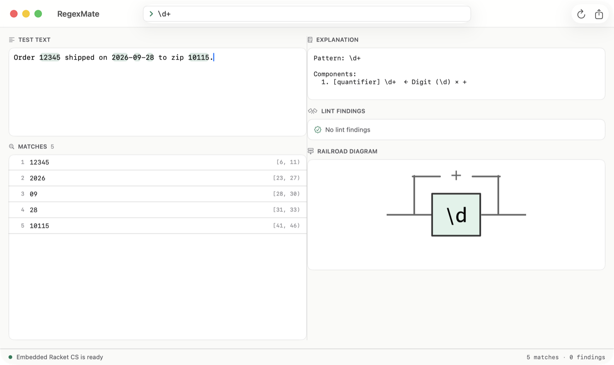

# RegexMate

**The regex workbench for the agent era — validate, match, explain, replace, graph, batch-test and lint regular expressions from one cross-platform CLI.**
Versioned JSON contract, a native MCP server, exit codes that never lie, and online self-update. Standalone binaries for Windows, Linux and macOS — no runtime to install. Racket underneath.

**English** · [中文](README.zh-CN.md)

[](https://github.com/turinglambdaai/regexmate/actions/workflows/ci.yml)    [](LICENSE) 

## Why

Regex tooling today is either web-only (regex101), search-oriented (ripgrep) or silent (grep). RegexMate is a small, honest CLI that does seven verbs well and speaks JSON natively:

- **validate** — check a pattern against the Racket `pregexp` flavor, single-line error messages
- **match** — run a pattern against text or stdin; highlighted in a terminal, structured over a pipe
- **explain** — narrate every part of a pattern in plain English or 中文
- **replace** — substitute with backreferences, with a replacement count
- **graph** — render a railroad diagram as SVG, for specs and pull requests
- **test** — assert a pattern against JSON cases and get per-case evidence: the write → test → refine loop agents need
- **lint** — deterministic static findings (catastrophic-backtracking nesting, quantified assertions, empty/duplicate/shadowed alternation branches), `--strict` gates CI
- **mcp** — a stdio MCP server exposing all seven tools natively to coding agents
- **schema** — the machine-readable contract, described by the tool itself

Everything ships as a standalone binary — no Racket installation required on target machines. A [`SKILL.md`](SKILL.md) ships in the repository for agent platforms that load skill cards.

## Install

Download from [Releases](https://github.com/turinglambdaai/regexmate/releases/latest) — every archive carries the CLI and the native desktop app:

| Platform | Download | Includes |
|---|---|---|
| macOS 14+ (Apple Silicon) | `regexmate-macos-aarch64-v<version>.tar.gz` | CLI + `gui/regexmate-gui.app` (ad-hoc signed — first launch: right-click → Open) |
| Windows 10+ x64 | `regexmate-windows-x86_64-v<version>.zip` | CLI + `gui\regexmate-gui.exe` |
| Linux x64 | `regexmate-linux-x86_64-v<version>.tar.gz` | CLI + `gui/RivetHost` (GTK4) |

Every release carries per-file `.sha256` checksums and a `SHA256SUMS` manifest. The CLI updates itself in place — see [Self-update](#self-update).

**Package managers:**

```bash
brew install turinglambdaai/tap/regexmate   # macOS, Apple Silicon
```

```powershell
```

**Windows single-file exe** (CLI only, no GUI): grab `regexmate-standalone-windows-x86_64-*.exe` from the release - install and run directly..

**Racket package:**

```bash
raco pkg install https://github.com/turinglambdaai/regexmate.git
```

**From source** (Racket 9.x):

```bash
git clone https://github.com/turinglambdaai/regexmate
cd regexmate
raco make main.rkt
racket run-tests.rkt          # test suite
raco exe -o regexmate main.rkt  # produce your own binary
```

## Quick start

```console
$ regexmate validate '^\d{3}-\d{4}$'
Pattern: ^\d{3}-\d{4}$
✓ Valid syntax

$ regexmate match '\d+' 'abc 123 def 456'
Found 2 match(es):
  at 4-7: "123"
  at 12-15: "456"

$ regexmate explain '(?:\d{2,4}|[a-z]+)(?=x)'
Pattern: (?:\d{2,4}|[a-z]+)(?=x)

Components:
  1. [group] (?:\d{2,4}|[a-z]+)
       ← Non-capturing group (?:...): Digit (\d) × {2,4} | Character class: [a-z] × +
  2. [lookaround] (?=x)
       ← Positive lookahead (?=...): Literal: x

$ regexmate replace '(\w+)@(\w+)' '\1 AT \2' 'mail a@b'
Replaced 1 occurrence(s).
Result: mail a AT b

$ regexmate graph 'ab(c|d)*' -o diagram.svg
SVG saved to: diagram.svg
```

## Desktop GUI

Every release archive ships `regexmate-gui` — a native app (SwiftUI / WinUI 3 / GTK4) on the same Racket core, embedded via [Rivet](https://github.com/turinglambdaai/rivet). No WebView, no Electron. The pattern lives in the toolbar and re-evaluates as you type: matches are highlighted inside your sample text, and the match list, explanation, lint findings and the railroad diagram update live:



## Self-update

```console
$ regexmate update --check
Latest release: v0.4.0 (installed: 0.3.0)

$ regexmate update
Downloading regexmate-macos-aarch64-v0.4.0.tar.gz …
Verifying checksum…
Installing …
Updated to v0.4.0. Run `regexmate --version` to confirm.
```

Standalone installs update themselves in place from GitHub Releases: the download's SHA-256 is verified against the published checksum, and the running binary is swapped safely (renamed aside, cleaned up on next start). `--json` emits the standard envelope for agents and scripts. Source and `raco pkg` installs are pointed at `git pull` / `raco pkg update` instead.

## MCP server

```json
{
  "mcpServers": {
    "regexmate": {
      "command": "regexmate",
      "args": ["mcp"]
    }
  }
}
```

Newline-delimited JSON-RPC 2.0 over stdio, protocol `2024-11-05`. Tools: `regexmate_validate`, `regexmate_match`, `regexmate_explain`, `regexmate_replace`, `regexmate_graph`, `regexmate_test`, `regexmate_lint` — each with an input schema discoverable via `tools/list`.

## Agent workflow

See [docs/agents-guide.md](docs/agents-guide.md) for the full walkthrough: the write → validate → test → lint → ship loop, the MCP tool reference, lint rule meanings and a worked example.

## Test and lint

```console
$ printf '{"cases":[{"text":"2026-09-28","expect":"match","contains":"2026"},{"text":"2026-13-01","expect":"no-match"}]}' | regexmate test '\d{4}-(0[1-9]|1[0-2])-(0[1-9]|[12]\d|3[01])'
  ✓ "2026-09-28"
  ✓ "2026-13-01"
Passed 2 of 2 case(s).

$ regexmate lint '(a+)+|a|'
2 finding(s):
  [warning] nested-quantifier at 0: nested quantifiers over a group can backtrack catastrophically on non-matching input
  [warning] empty-branch at 8: alternative 2 is empty — it matches the empty string, usually a bug

$ regexmate schema --json   # the contract, from the tool itself
```

## JSON contract (`regexmate/v1`)

Every command accepts `--json` and emits a single-line envelope with stable keys: `schema`, `command`, `ok`.

```console
$ regexmate match '(\w+)@(\w+)' 'mail a@b' --json
{"command":"match","count":1,"matches":[{"end":8,"groups":[{"end":6,"index":1,"name":null,"start":5,"value":"a"},{"end":8,"index":2,"name":null,"start":7,"value":"b"}],"start":5,"value":"a@b"}],"ok":true,"pattern":"(\\w+)@(\\w+)","schema":"regexmate/v1","text":"mail a@b"}
```

Contract rules:

- Spans are absolute indices, `[start, end)` — end exclusive.
- Capture groups are 1-based; `name` is reserved for future named-group support; absent groups are `null`, never missing keys.
- Errors carry a single-line `error` string (no embedded newlines).
- `graph --json` embeds the SVG markup; `graph -o FILE --json` reports `output` and `bytes`.

### Exit codes

| Code | Meaning |
|------|---------|
| `0` | ok — match found / pattern valid / replacements done |
| `1` | invalid regular expression |
| `2` | usage error (unknown command or flag) |
| `3` | valid pattern, zero matches / zero replacements |

## Regex flavor

RegexMate validates and matches with Racket's `pregexp` engine. Supported: `. ^ $ * + ? {n,m}` (greedy and lazy), `( ) (?: )`, lookarounds `(?=) (?!) (?<=) (?<!)`, atomic groups `(?>)`, flag groups `(?i:…) (?is:…) (?-i:…)`, character classes with ranges / negation / POSIX names (`[:alpha:]`), escapes `\d \D \w \W \s \S \b \B`, backreferences `\1`–`\9`, and unicode classes `\p{…}` / `\P{…}`.

Not supported by the engine (and therefore rejected by `validate`): named groups `(?<name>…)`, `\A`/`\z` anchors, `\x41` hex escapes. `explain` and `graph` degrade gracefully on valid-but-unmodelable syntax.

## Localization

Human output is English by default. `--lang zh` or the `REGEXMATE_LANG=zh` environment variable switches every message, including `explain` descriptions. `NO_COLOR` disables ANSI highlighting.

## Development

```bash
racket run-tests.rkt      # unit tests
bash scripts/smoke.sh     # CLI end-to-end smoke test
racket scripts/check-version.rkt v1.0.0   # release gate
```

CI runs the unit tests and smoke test on Ubuntu, Windows and macOS against Racket 9.2, and compile-checks the GTK4 host; tagged pushes build the CLI and the native GUI for all three platforms and publish a GitHub release with SHA-256 checksums.

## Project structure

```
regexmate/
├── main.rkt                 # CLI entry point
├── version.rkt              # runtime version (must match info.rkt)
├── info.rkt                 # Racket package metadata
├── core/                    # regex AST, parser, engine, i18n
├── output/                  # JSON envelopes, human output, ANSI, railroad
├── server/
│   └── mcp.rkt              # stdio MCP server
├── app/
│   └── backend.rkt          # Rivet backend (typed RPC surface for the GUIs)
├── macos-host/              # SwiftUI host (SwiftPM)
├── windows/                 # WinUI 3 host (C++/WinRT)
├── linux/                   # GTK4 host (CMake)
├── branding/                # app icon (SVG source, .icns, .ico)
├── tests/                   # rackunit suites
├── scripts/                 # smoke.sh, check-version.rkt
├── docs/                    # product homepage (GitHub Pages)
└── .github/workflows/       # ci.yml, release.yml
```

## Roadmap

- Signed installers and notarization (the macOS GUI is ad-hoc signed today)
- More package managers (AUR PKGBUILD is ready, awaiting an AUR account)
- Named capture groups `(?<name>…)` when the engine grows them

## License

[MIT](LICENSE)
